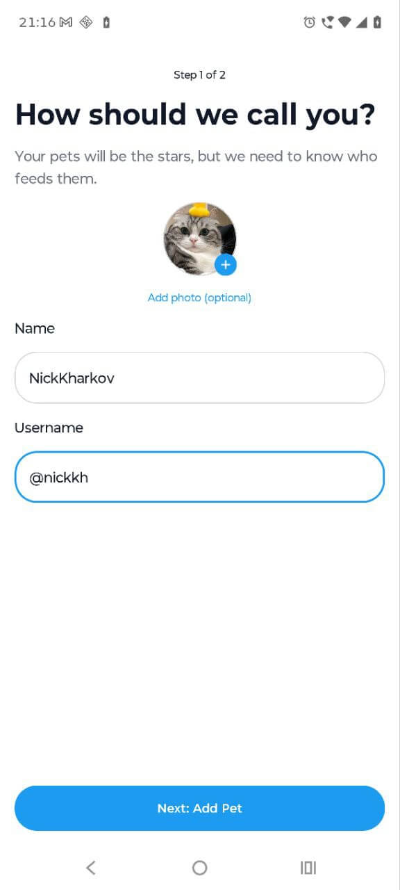
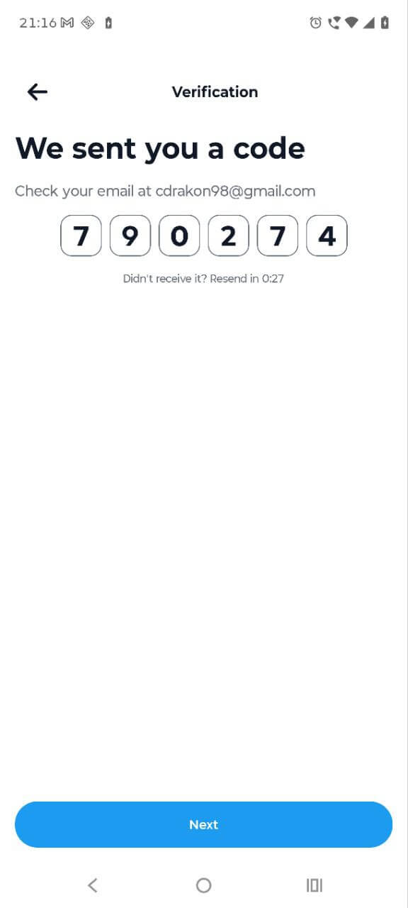
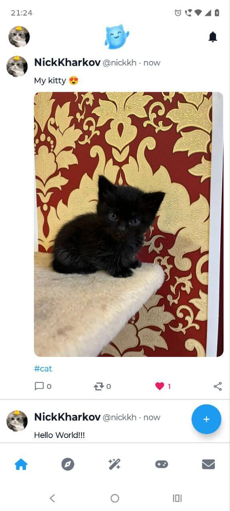
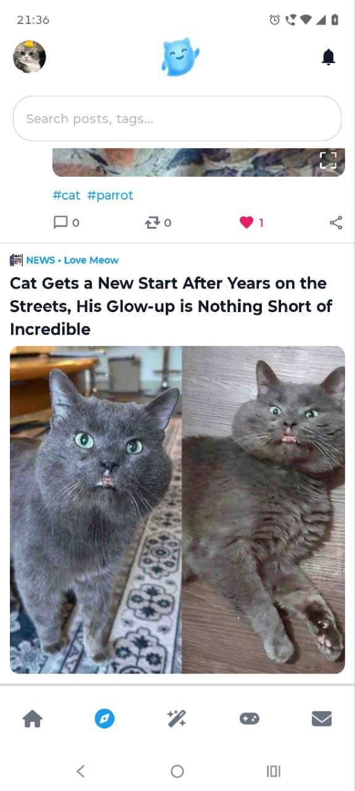
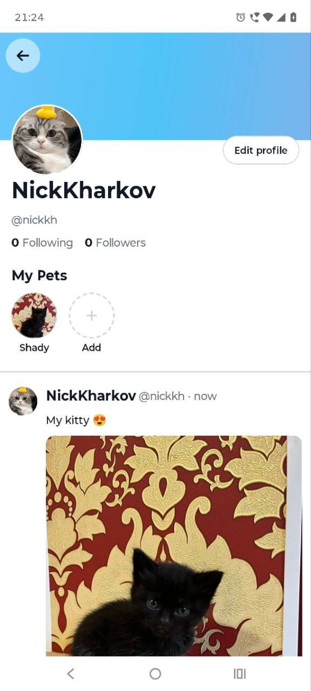
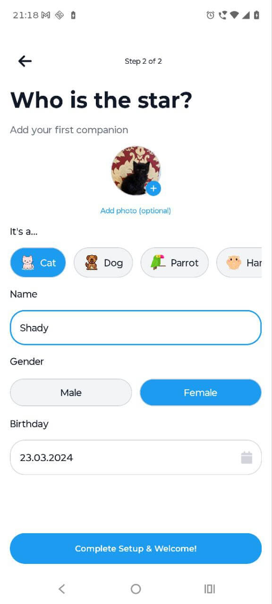
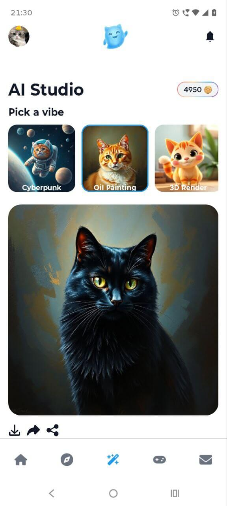
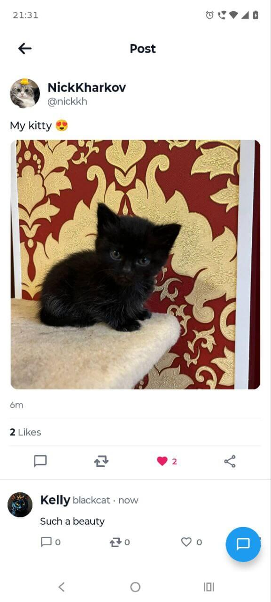

# 🐱 Whiskr Client (iOS & Android)


**Whiskr** is a cross-platform social network for pets built with **Compose Multiplatform**. It demonstrates a modern architecture, handling complex user flows, real-time communication, AI integration, and payments on both iOS and Android from a single codebase.

**Backend Repository:** [Whiskr Backend Server](https://github.com/NikKharkov/WhiskrBackend)

---

## Screenshots 📱

### Onboarding & Auth
|          Login Screen           |           User Registration           |               Verification Flow               |
|:-------------------------------:|:-------------------------------------:|:---------------------------------------------:|
|  |  |  |

### Core Experience
|           Home Feed           |          Explore & Search           |                 Create Post                 |
|:-----------------------------:|:-----------------------------------:|:-------------------------------------------:|
|  |  |  |

### Profile & Social
|            User Profile             |          Pet Registration           |                  Notifications                  |
|:-----------------------------------:|:-----------------------------------:|:-----------------------------------------------:|
|  |  |  |

### AI & Features
|                AI Studio                |        Real-time Chat         |         Comments & Replies          |
|:---------------------------------------:|:-----------------------------:|:-----------------------------------:|
|  |  |  |

### Monetization
|     Premium Shop (Stripe)     |
|:-----------------------------:|
|  |

## 🛠 Tech Stack

The project leverages the most advanced libraries in the Kotlin Multiplatform ecosystem:

* **UI Framework:** Compose Multiplatform
* **Navigation:** Decompose
* **Architecture:** Feature-Based Modularization + MVI
* **Dependency Injection:** Kotlin Inject
* **Networking:** Ktor + Ktorfit
* **Local Storage:** Room KMP + KVault (Secure storage)
* **Media Loading:** Coil 3 + Chaintech Mediaplayer
* **Integration:**
    * **Firebase:** Auth & Messaging (KMP Auth)
    * **Stripe:** Payment processing
    * **WebSockets:** Real-time chat features
    * **KMPNotifier:** Push notifications with deeplink logic

## 📂 Project Structure

* `core/`: Shared components, networking, storage, and UI kit.
* `features/`: Independent feature modules (Auth, Chat, Feed, AI Studio, etc.).
* `flows/`: High-level navigation flows integrating multiple features.
* `composeApp/`: Main entry point assembling the application.

## 🚀 How to Run

### Configuration
The project requires a constants file with API keys (Base URL, Stripe Key, etc.).
Ensure `Constants.kt` is properly configured in the `commonMain` source set before building.

### Android
Open the project in **Android Studio** and run the `app` configuration.

### iOS
1.  Navigate to the iOS directory:
    ```bash
    cd iosApp
    ```
2.  Install Pods (required for Firebase/Stripe):
    ```bash
    pod install
    ```
3.  Open `iosApp.xcworkspace` in Xcode and run.

---